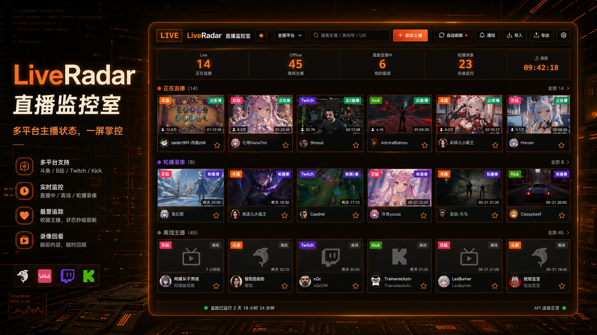
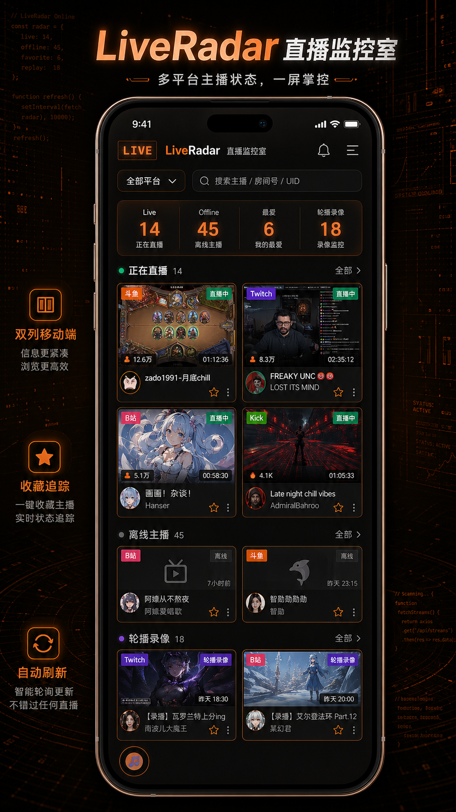
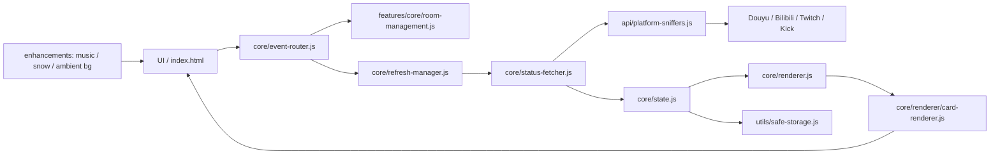

# LiveRadar 直播监控室

<div align="center">


**多平台直播状态监控面板。一个页面集中查看斗鱼、B站、Twitch、Kick 主播的直播、离线和轮播录像状态。**

[在线体验](https://liveradar.pages.dev/) · [快速开始](#快速开始) · [功能特性](#功能特性) · [项目结构](#项目结构) · [开发与验证](#开发与验证)

</div>



> README 中的宣传图为项目辅助展示图，真实运行界面以当前代码和浏览器渲染为准。

## 项目定位

LiveRadar 是一个 Vite / Tailwind / Vanilla JavaScript 构建的直播监控 Web App。它面向需要同时关注多个平台主播状态的使用场景：直播中、离线、轮播录像、收藏主播、手动或自动刷新、导入导出备份。

当前版本的视觉方向是 Half-Life: Alyx 风格的工业橙色控制台：暗色底、橙色主光、紧凑信息密度、卡片 hover 放大、平台品牌色反馈，以及轻量纯代码动态背景。

## 功能特性

### 监控能力

- 支持平台：斗鱼、B站、Twitch、Kick。
- 分区展示：正在直播、离线、轮播录像。
- 指标信息栏：Live、Offline、最爱直播中。
- 支持主播封面、头像、标题、房间号、观看人数、直播时长等关键信息。
- 收藏主播使用金色边框标识，不受在线/离线状态影响。

### 操作体验

- 顶部命令栏：平台选择、搜索/房间号输入、添加主播、自动刷新、导入、导出、手动刷新。
- 搜索历史支持键盘操作与删除。
- 卡片 hover 放大，信息区可根据平台品牌色反馈。
- 删除按钮 hover 时转为红色反馈，降低误操作感知成本。
- iPhone 视图保留左右安全边距，并使用双列卡片提升信息量。

### 数据与本地能力

- 主播列表本地持久化。
- 支持 JSON / LiveRadar 备份导入导出。
- 自动刷新倒计时。
- 批量状态获取、增量渲染和图片加载恢复。
- 页面可在静态部署环境运行。

### 氛围与增强功能

- Alyx 工业橙色 UI 主题。
- 纯代码动态背景：慢速字符层、橙色环境光、鼠标划过的柔和反馈。
- 下雪特效模块，按需加载。
- 浮动音乐播放器，支持播放/暂停、上一曲/下一曲、进度、音量、圆形播放进度和专辑背景。
- 移动端降低或关闭高成本动态效果，尊重 `prefers-reduced-motion`。

## 移动端预览

<p align="center">
  
</p>

## 技术栈

| 分类 | 技术 |
| --- | --- |
| 前端 | Vanilla JavaScript ES Modules |
| 构建 | Vite 7 |
| 样式 | TailwindCSS + 原生 CSS 主题层 |
| 测试 | Vitest + jsdom / happy-dom |
| 质量 | ESLint + Prettier + Husky + lint-staged |
| 部署 | 静态站点，支持 Cloudflare Pages / Netlify / Vercel / Nginx |

## 架构概览



核心思路：

- `core/` 管启动、状态、事件路由、刷新调度、状态获取、渲染入口。
- `features/` 管业务功能，例如房间管理、导入导出、自动刷新、音频与增强效果。
- `api/` 管平台状态获取和代理策略。
- `styles/` 管基础样式、响应式、移动端和 Alyx 主题。
- `utils/` 管安全存储、DOM 缓存、资源释放、设备检测、错误处理等基础工具。

## 快速开始

### 环境要求

- Node.js `>= 20.19.0`
- npm
- 现代浏览器：Chrome / Edge / Firefox / Safari

### 安装与启动

```bash
git clone https://github.com/Feeengyuuu/LiveRadar.git
cd LiveRadar
npm install
npm run dev
```

开发服务器默认运行在：

```text
http://localhost:3000
```

### 构建生产版本

```bash
npm run build
npm run preview
```

构建产物输出到 `dist/`。

## 使用说明

### 添加主播

1. 在顶部选择平台。
2. 输入房间号、UID 或平台支持的主播标识。
3. 点击“添加主播”。

### 管理主播

- 点击卡片：打开对应直播页面。
- 点击星标：切换收藏状态。
- 点击垃圾桶：删除主播。
- 点击刷新：手动刷新全部主播状态。
- 开启自动刷新：按倒计时周期更新状态。

### 导入导出

- 导出会保存当前主播列表备份。
- 导入可恢复之前的备份文件。
- 建议在大量调整主播列表前先导出一份备份。

## 开发与验证

```bash
# 启动开发服务器
npm run dev

# 运行单元测试
npm run test:run

# ESLint 检查
npm run lint

# 生产构建
npm run build

# 预览构建结果
npm run preview
```

当前常规验证标准：

- `npm run lint`
- `npm run test:run`
- `npm run build`
- 本地页面 `http://127.0.0.1:3000/` 可访问

## 项目结构

```text
LR_online/
├─ index.html
├─ package.json
├─ vite.config.js
├─ vitest.config.js
├─ public/
│  ├─ covers/
│  ├─ music/
│  ├─ readme-hero.png
│  └─ readme-mobile.png
├─ src/
│  ├─ api/                 # 平台状态获取、代理与签名
│  ├─ config/              # 常量、代理、UI 文案
│  ├─ core/                # 启动、状态、刷新、事件、渲染
│  ├─ features/
│  │  ├─ audio/            # 音频解锁与音效
│  │  ├─ core/             # 自动刷新、导入导出、房间管理
│  │  └─ enhancements/     # 音乐播放器、下雪、动态背景
│  ├─ styles/              # CSS 入口、组件、响应式和主题
│  ├─ types/               # JSDoc 类型定义
│  └─ utils/               # 存储、DOM、资源、设备、错误处理
├─ functions/              # 平台状态相关服务端/边缘函数
├─ docs/                   # 架构、安全、迁移、部署等文档
└─ tests/                  # 测试辅助
```

## 设计原则

- 监控面板优先：信息密度、扫描效率和稳定性优先于装饰。
- 轻量动态：背景和特效使用 CSS 与少量 JS 控制，不使用视频背景或重型粒子。
- 渐进增强：移动端、省电偏好和低性能设备自动降级。
- 可恢复：导入导出和本地存储优先保证用户列表安全。
- 可维护：事件委托、状态集中管理、模块边界清晰。

## 部署

### Cloudflare Pages / Netlify / Vercel

```text
Build command: npm run build
Output directory: dist
Node version: 20.x
```

### Nginx 静态部署

```dockerfile
FROM node:20-alpine AS build
WORKDIR /app
COPY package*.json ./
RUN npm ci
COPY . .
RUN npm run build

FROM nginx:alpine
COPY --from=build /app/dist /usr/share/nginx/html
EXPOSE 80
```

## 注意事项

- 本项目需要访问第三方直播平台信息，平台接口、跨域策略和频率限制可能随时变化。
- 请合理设置刷新频率，避免对平台产生过高请求压力。
- 用户数据主要保存在浏览器本地，清理浏览器数据会导致列表丢失。
- 建议定期导出备份。

## 合规声明

本项目仅供学习、研究和个人效率工具用途。使用者需要自行遵守各平台服务条款、当地法律法规、版权与隐私要求。请勿将本项目用于未经授权的数据采集、商业化监控或高频请求。

## 致谢

- Idea by Fengyu Xu
- Built with Gemini, Claude and Codex
- Powered by Vite, TailwindCSS and the open-source ecosystem

---

<div align="center">

**FOR LEARNING & RESEARCH ONLY. PLEASE COMPLY WITH LOCAL LAWS AND PLATFORM RULES.**

</div>
