# LiveRadar 直播雷达

<div align="center">


**一个用于集中查看多平台主播直播状态的轻量监控面板。**

[在线体验](https://liveradar.pages.dev/) · [快速开始](#快速开始) · [平台支持](#平台支持) · [验证命令](#验证命令)

</div>

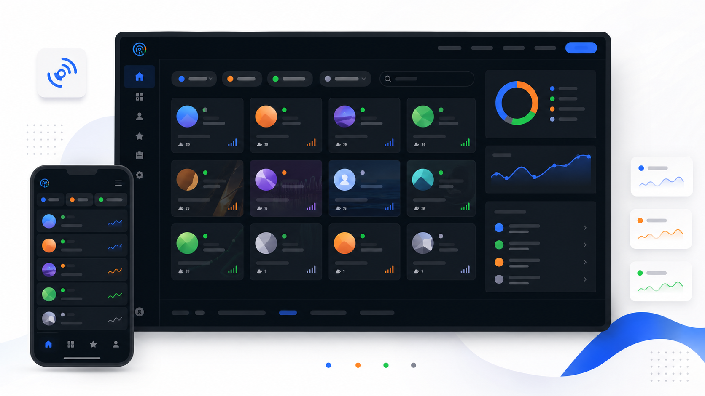

> README 配图采用简洁现代的产品宣传风格，用来解释功能结构和视觉方向。真实界面以当前代码在浏览器中的渲染结果为准。

## 项目定位

LiveRadar 是一个用 Vite、Tailwind 和原生 JavaScript 构建的直播监控 Web App。它把不同平台的主播状态收进同一个页面，方便快速判断谁正在直播、谁离线、谁处于轮播/录像状态，以及哪些房间需要重点关注。

这个项目的重点是“轻量、直观、可备份、可部署”。它不要求额外账号系统，主播列表保存在本地，支持导入导出，并可在静态部署环境中搭配服务端状态接口使用。

## 当前版本重点

- 新增 Picarto、SOOP/AfreecaTV 支持，和原有斗鱼、B 站、Twitch、Kick 一起进入统一刷新状态。
- SOOP/AfreecaTV 默认走 `/api/status` 服务端路径，避免浏览器直连 CORS 限制。
- 本地 Vite 开发环境内置 `/api/status` 与 `/api/status/batch`，方便在 `localhost` 直接测试服务端状态路径。
- 刷新状态、临时通知区域和移动端布局做过收敛，减少刷新时的边缘闪烁和信息挤压。
- 大量主播卡片场景下减少不必要的 DOM 查询、图片重载和高成本 hover 动效。
- 头像与封面加载更稳：支持无 referrer 加载、协议相对 URL 修正、多级 fallback、失败后重试和封面兜底头像位。
- 雪花特效保持独立按需加载，不阻塞核心状态监控。

## 功能画廊

<table>
  <tr>
    <td width="50%">
      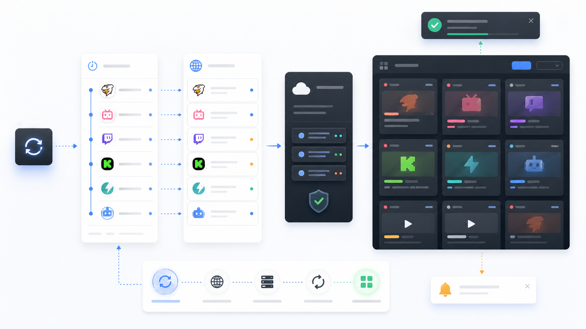
      <br />
      <strong>刷新状态</strong><br />
      手动刷新、自动刷新、批量状态更新和临时通知区域统一收敛。
    </td>
    <td width="50%">
      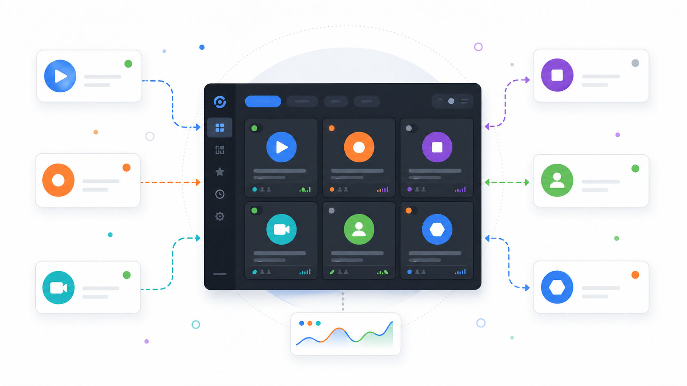
      <br />
      <strong>多平台集中</strong><br />
      斗鱼、B 站、Twitch、Kick、Picarto、SOOP/AfreecaTV 放在同一个卡片网格里管理。
    </td>
  </tr>
  <tr>
    <td width="50%">
      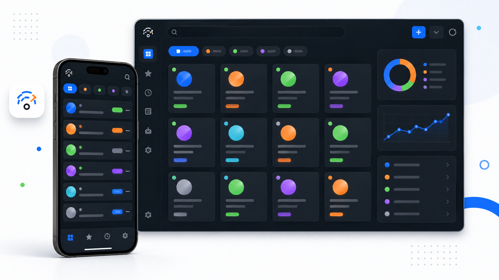
      <br />
      <strong>移动端适配</strong><br />
      iPhone 宽度下保留安全边距，压缩命令区域，维持卡片可扫读性。
    </td>
    <td width="50%">
      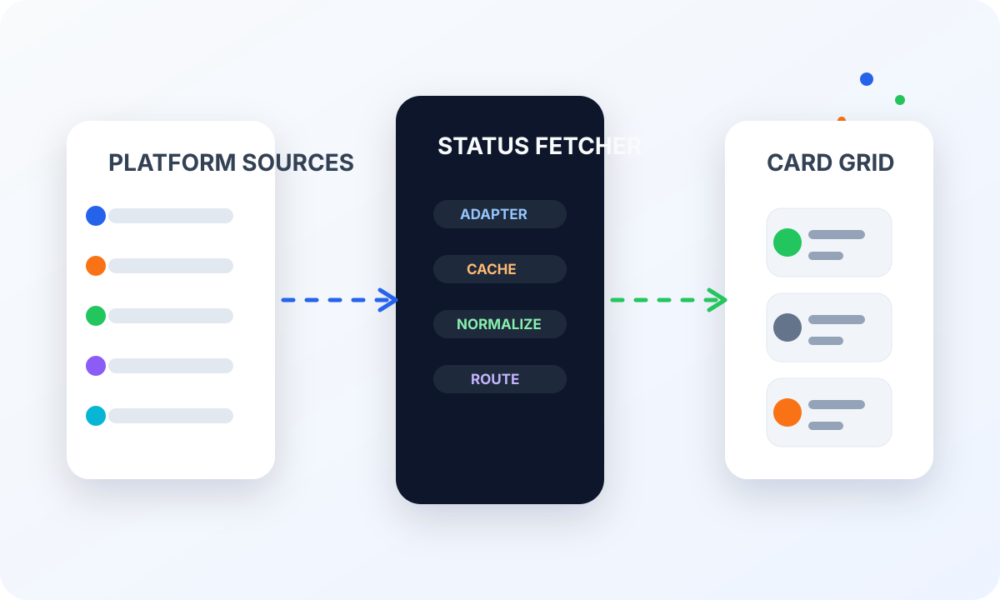
      <br />
      <strong>状态链路</strong><br />
      平台数据经过状态获取、缓存、标准化和渲染后进入卡片。
    </td>
  </tr>
</table>

<table>
  <tr>
    <td width="33%">
      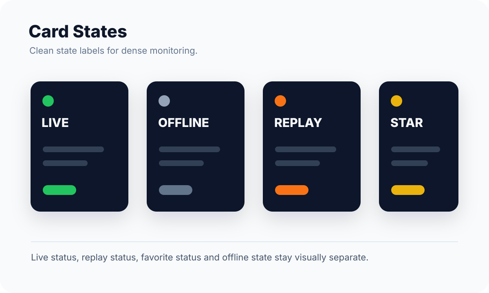
      <br />
      <strong>卡片状态</strong><br />
      Live、Offline、Replay、Favorite 独立表达。
    </td>
    <td width="33%">
      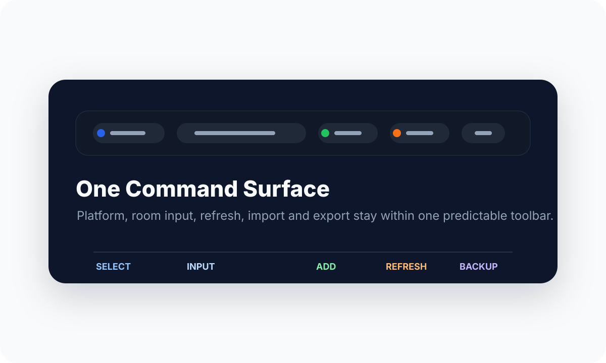
      <br />
      <strong>命令栏</strong><br />
      平台选择、房间输入、导入导出和刷新入口集中放置。
    </td>
    <td width="33%">
      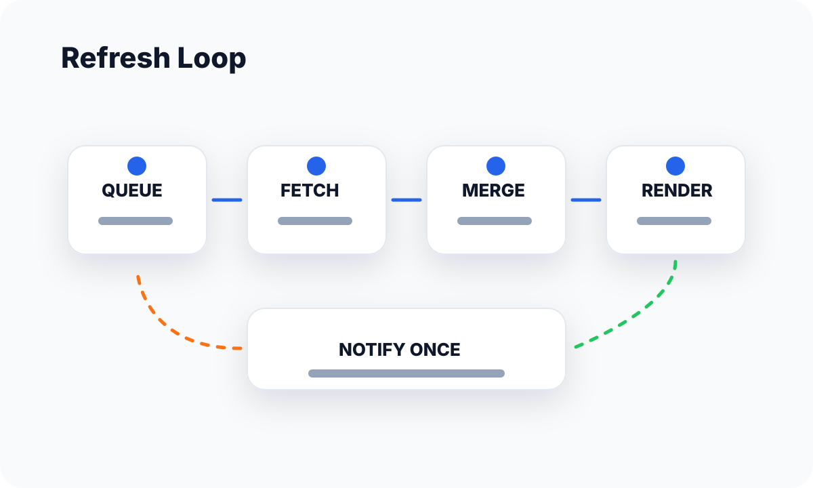
      <br />
      <strong>刷新闭环</strong><br />
      队列、状态拉取、增量更新、通知反馈保持清晰边界。
    </td>
  </tr>
  <tr>
    <td width="33%">
      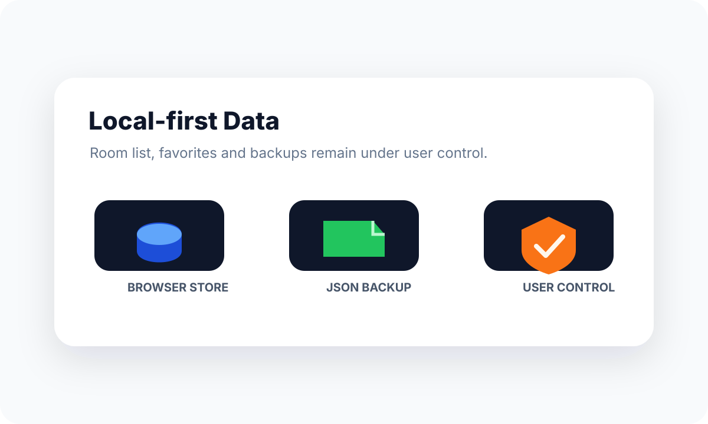
      <br />
      <strong>本地数据</strong><br />
      主播列表、收藏状态和备份文件由用户掌握。
    </td>
    <td width="33%">
      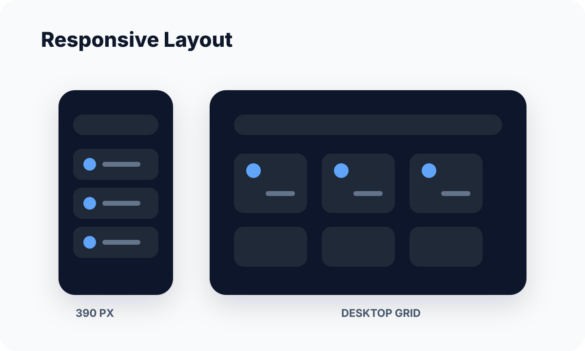
      <br />
      <strong>响应式布局</strong><br />
      针对窄屏、平板和桌面宽度保持稳定布局。
    </td>
    <td width="33%">
      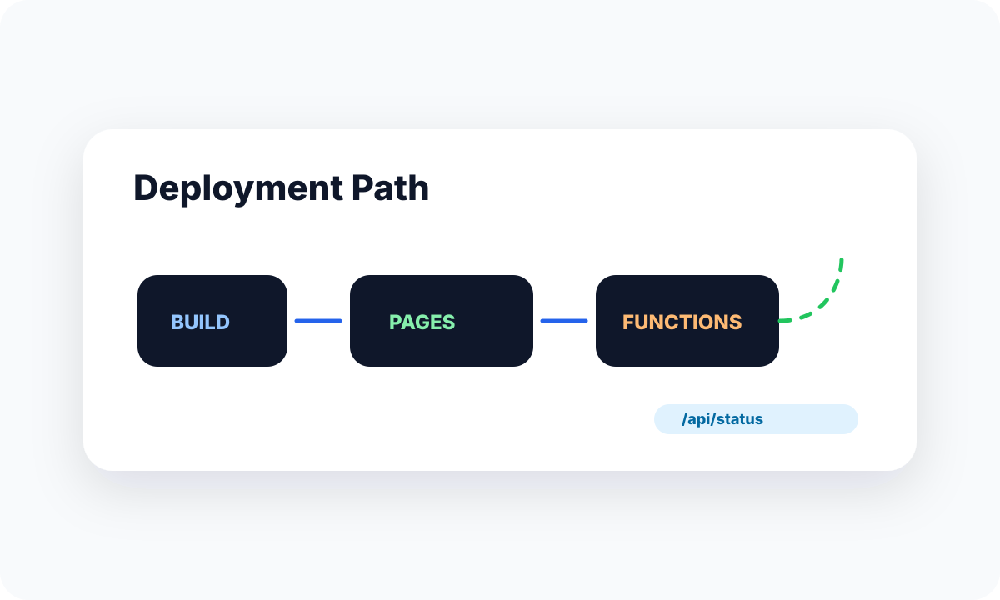
      <br />
      <strong>静态部署</strong><br />
      前端可静态部署，状态接口可由 Pages Functions 接管。
    </td>
  </tr>
</table>

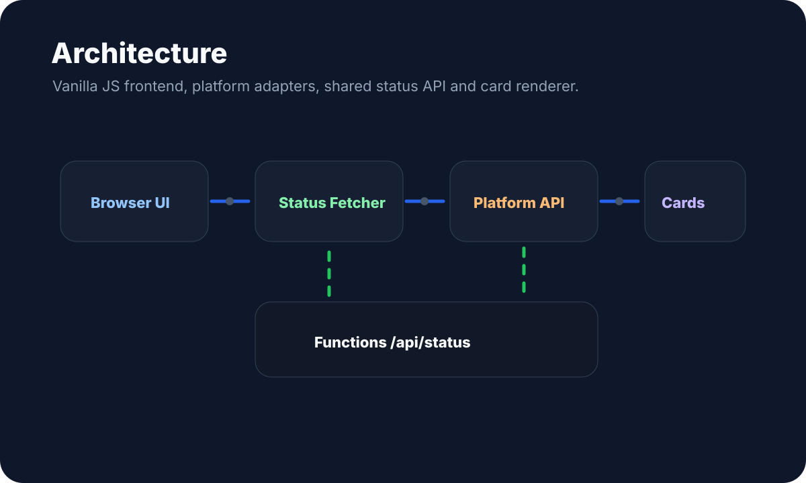

## 平台支持

| 平台 | 输入方式 | 当前能力 | 备注 |
| --- | --- | --- | --- |
| 斗鱼 | 房间号 | 直播、离线、轮播/录像、标题、封面、头像、热度类指标 | 国内平台接口字段可能随站点调整变化。 |
| B 站直播 | 房间号 | 直播、离线、轮播/录像、标题、封面、头像、热度类指标 | 人气值不等同于精确观看人数。 |
| Twitch | Channel ID | 直播状态、标题、封面、头像、观看人数相关信息 | 无 OAuth 时使用开放状态路径，语义弱于官方凭证路径。 |
| Kick | Channel ID | 直播状态、标题、封面、头像、观看人数相关信息 | 依赖公开接口可用性。 |
| Picarto | Channel name / ID | 直播状态、标题、封面、头像、观看人数相关信息 | 适合创作类直播补充监控。 |
| SOOP / AfreecaTV | BJ ID | 直播状态、标题、封面、头像、观看人数相关信息 | 浏览器直连容易受 CORS 限制，默认走 `/api/status`。 |

## 核心能力

- 添加、删除、收藏主播卡片。
- 按直播中、离线、轮播/录像等状态分区展示。
- 手动刷新与自动刷新并存，刷新提示集中在临时通知区域。
- 支持 JSON / LiveRadar 备份导入导出，方便迁移或恢复主播列表。
- 图片加载失败时自动降级，头像失败时可尝试使用封面兜底。
- 卡片渲染支持增量更新，减少大量主播同时刷新时的 UI 抖动。
- 尊重 `prefers-reduced-motion`，移动端降低高成本动效。
- 雪花、音乐播放器等增强效果按需加载，不阻塞核心监控能力。

## 架构概览

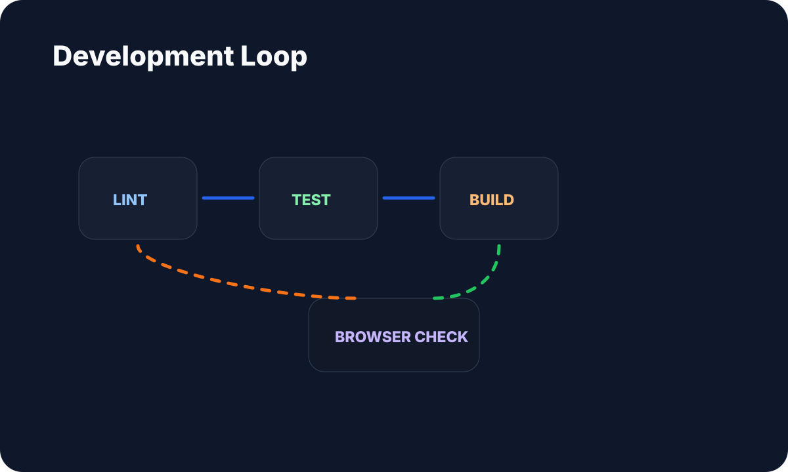

```text
Browser UI
  -> src/core/status-fetcher.js
  -> src/api/platform-adapter.js
  -> direct public endpoints or /api/status
  -> functions/_shared/platform-status.js
  -> card renderer and local persistence
```

主要边界：

- `src/core/` 负责刷新、状态调度和渲染协调。
- `src/core/renderer/` 负责卡片 DOM、图片恢复和网格更新。
- `src/api/` 负责平台适配、直连探测和服务端状态路径选择。
- `functions/_shared/` 复用到 Cloudflare Pages Functions 与本地 Vite dev API。
- `src/features/` 放置导入导出、通知、雪花、音乐播放器等功能模块。
- `src/styles/alyx-theme.css` 是主要视觉样式入口。

## 快速开始

要求 Node.js `>=20.19.0`。

```bash
npm install
npm run dev
```

默认开发地址：

```text
http://localhost:3000/
```

如果 3000 端口已被占用，可以指定端口：

```bash
npm run dev -- --host 127.0.0.1 --port 3002 --strictPort --open false
```

## 验证命令

```bash
npm run lint
npm run test:run
npm run build
```

当前交付基线已覆盖 lint、全量 Vitest 和生产构建。界面相关改动建议再扫查 `390`、`640`、`900`、`1100`、`1280`、`1440`、`1920` 宽度，重点看命令栏、通知区域、卡片头像、卡片边缘和横向溢出。

## 部署

LiveRadar 可以作为静态站点部署，也可以搭配 Cloudflare Pages Functions 提供 `/api/status` 与 `/api/status/batch`：

```text
Frontend static assets
  -> Cloudflare Pages
  -> /api/status for server-required platforms
```

SOOP/AfreecaTV 这类浏览器直连不稳定的平台，建议始终通过服务端状态 API 获取数据。

## 数据与合规说明

- 本项目面向学习、个人监控面板和前端工程实践。
- 平台公开接口可能随时变化，状态字段不能保证永久稳定。
- 不建议高频刷新；应尊重第三方平台的访问限制。
- 主播列表、收藏和导入导出数据由浏览器本地保存，请定期备份。
- README 中的宣传图不是 UI 截图，真实效果以运行中的应用为准。
